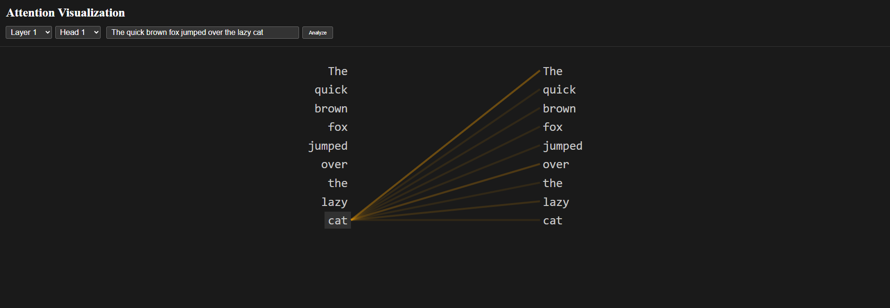

# Attention Visualization for DistilGPT-2

This project provides an interactive visualization of attention patterns in DistilGPT-2 model. It consists of a React frontend and a Flask backend that interfaces with the Hugging Face Transformers library.



## Features

- Interactive text input for analysis
- Real-time attention pattern visualization
- Multi-layer attention visualization
- Color-coded attention weights
- Responsive design

## Prerequisites

- Node.js (v14 or higher)
- Python (3.7 or higher)
- npm or yarn

## Setup Instructions

1. Clone the repository:

   ```bash
   git clone https://github.com/iserranoEJ/GPT-2-Attention-visualizer.git
   cd attention-visualizer
   ```

2. Install Frontend Dependencies:

   ```bash
   npm install
   ```

3. Set up Python Virtual Environment:

   ```bash
   # Create virtual environment
   python3 -m venv venv

   # Activate virtual environment
   # On Windows:
   venv\Scripts\activate
   # On macOS/Linux:
   source venv/bin/activate

   # Install Python dependencies
   pip install -r requirements.txt
   ```

## Running the Application

1. First, start the backend server:

   ```bash
   # Make sure your virtual environment is activated
   npm run backend
   ```

   The backend server will start on <http://localhost:5000>

2. In a new terminal, start the frontend development server:

   ```bash
   npm run dev
   ```

   The frontend will be available at <http://localhost:5173> (or similar URL shown in terminal)

## Project Structure

   ```text
   attention-visualizer/
   ├── src/
   │   ├── backend/
   │   │   └── app.py         # Flask backend server
   │   ├── frontend/
   │     └──components/
   │          └── AttentionVisualization.jsx  # Visualization component
   │          └── InteractiveVisualization # Alternative visualization component (currently used)
   │     └──App.jsx            # Main React component
   ├── package.json
   ├── requirements.txt       # Python dependencies
   ├── vite.config.js
   └── README.md
   ```

## Usage

1. Once both servers are running, open your browser and navigate to <http://localhost:5173>
2. Enter text in the input field
3. Click "Update Visualization" to see the attention patterns
4. Use the "Previous Layer" and "Next Layer" buttons to explore different attention layers

## Common Issues

1. If you get a CORS error, make sure both servers are running and CORS is enabled in the backend
2. If you see "Failed to fetch attention data", verify that the backend server is running on port 5000
3. If you get module import errors, try reinstalling the requirements:

   ```bash
   pip install -r requirements.txt --force-reinstall
   ```

## Scripts

- `npm run dev`: Start the frontend development server
- `npm run build`: Build the frontend for production
- `npm run backend`: Start the Python backend server
- `npm run preview`: Preview the production build locally
- `npm run lint`: Run ESLint
